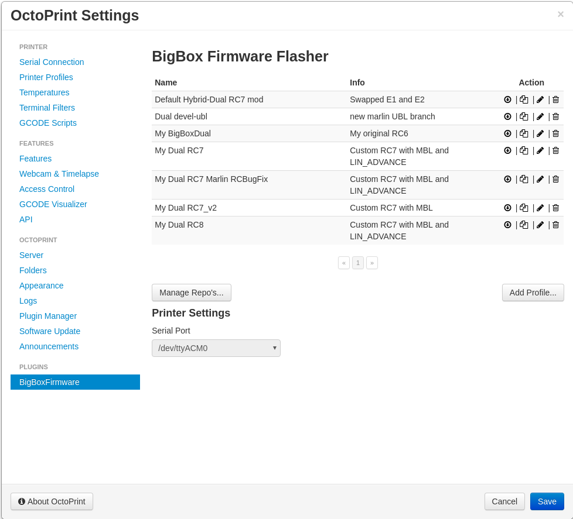
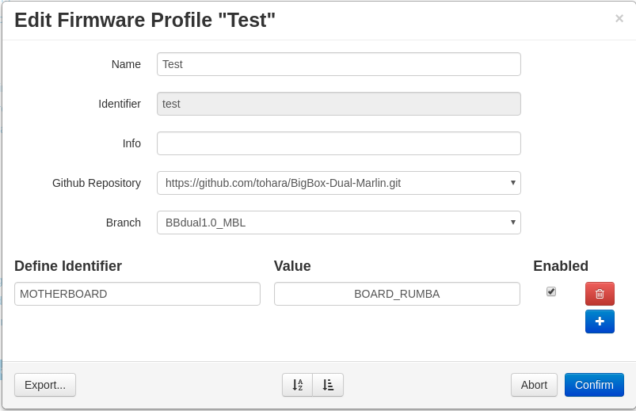
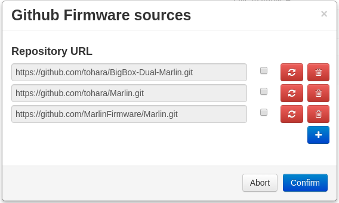

# OctoPrint-BigBoxFirmware 

Plugin to enable and disable features in the firmware and compile and flash using OctoPi.  

### Main Menu 

 

### Edit Profile
 

##### Github Repository / Branch:
		The Marlin Github repository used as baseline.

##### Define Identifier:
		The #define variable name from Configuration.h, Configuration_adv.h or pins_RUMBA.h.
	
##### Value:
		The value of the #define variable. Leave blank if no value is used.
		
##### Enabled:
		If this check box is not ticked the #define variable will be commented out in the configuration files.
		I.e: Enabled => "#define EXTRUDERS 2" , not enabled => "//#define EXTRUDERS 2"
		
##### Import / Export:
		A profile can be exported to a plain text file and imported when adding a new profile.		

### Repo Manager
 

##### Repository URL:
		Link to Github repo with Marlin source.
		If the checkbox is ticked this repo will always pull latest changes from Github before flashing.
		

## Setup

Install via the bundled [Plugin Manager](https://github.com/foosel/OctoPrint/wiki/Plugin:-Plugin-Manager)
or manually using this URL:

    https://github.com/tohara/OctoPrint-BigBoxFirmware/archive/master.zip
